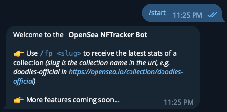
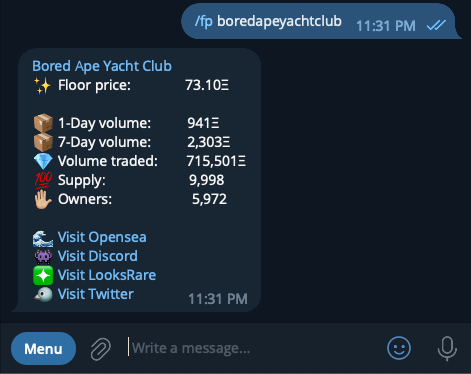
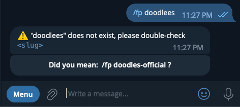
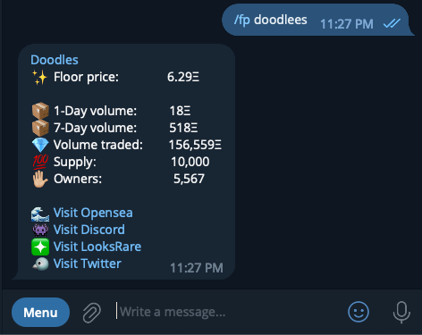

# NFTracker

NFTracker is a telegram bot that allows you to query and track Opensea collections' floorprices in a simple and user-friendly manner.

## Usage

Deployed instance: [link](https://t.me/NFTracker_bot)

Type `/start` to view basic commands for the telegram bot.



Type `/fp` followed by the Opensea slug, to reveal crucial information of the collection.



If you have entered the wrong slug, the bot would search for the closest match of popular collections within the postgres database.



Click the inline button to reveal the statistics of the closest match.



## Technical Specification

**Tech Stack**:

- Backend - Golang
- Databse - Postgres
- HTTP Framework - Chi for lightweight and composable routing

**Packages used**:

- [Golang Telegram Bot API](https://github.com/go-telegram-bot-api/telegram-bot-api) for interacting with telegram servers
- [Chi](https://github.com/go-chi/chi) for lightweight HTTP framework
- [go-pg](https://github.com/go-pg/pg) Golang ORM for postgres

**Deployment details**:

- Main server deployed on Railway.app
- Postgres DB instance provisioned by Railway.app

## Installation

1. Update `local.env` with your own Telegram bot token `BOTTOKEN` and Postgres database url `DATABASE_URL`

```bash
BOTTOKEN=
ENV=DEV
DATABASE_URL=
```

2. Run your own instance using docker

```bash
docker compose up --build
```
